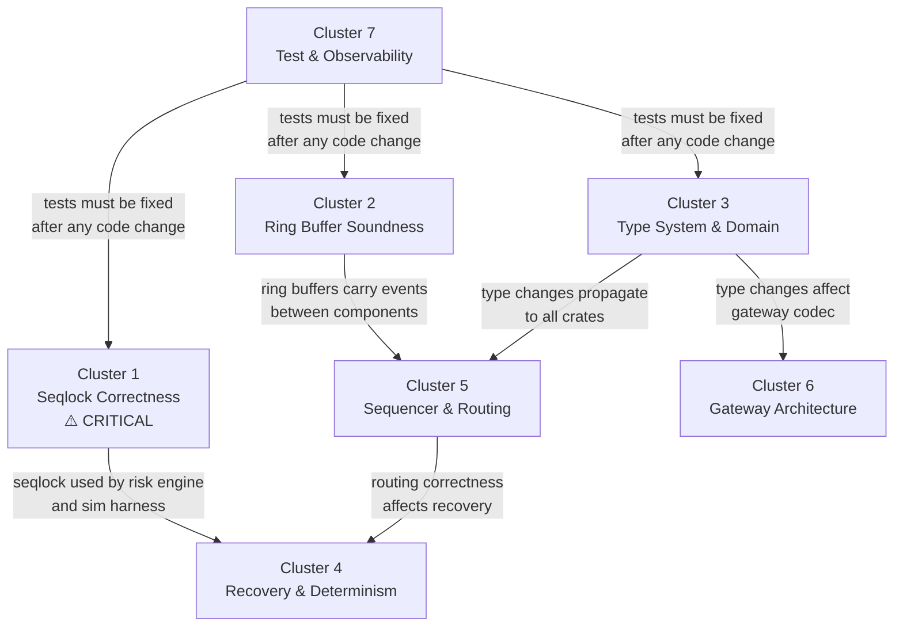

# Match-Risk-Engine — Comprehensive Codebase Audit

> **Scope**: All 12 workspace crates, ~6,500 LOC of library/binary code plus ~3,000 LOC of tests.
> **Methodology**: Full file-by-file read, no skimming. Every `unsafe` block, every atomic ordering, every public API boundary was evaluated.

---

## Table of Contents

1. [Executive Summary](#executive-summary)
2. [Findings by Category](#findings-by-category)
   - [Correctness](#correctness)
   - [Safety](#safety)
   - [Architecture](#architecture)
   - [Performance](#performance)
   - [Error Handling](#error-handling)
   - [Rust Idioms](#rust-idioms)
   - [Testing](#testing)
   - [Type Safety](#type-safety)
3. [Issue Clusters](#issue-clusters)
4. [Cluster Dependency Map](#cluster-dependency-map)
5. [Prioritised Fix Plan](#prioritised-fix-plan)

---

## Executive Summary

The codebase demonstrates strong foundational design: fixed-point arithmetic (no `f64`), lock-free primitives (SPSC/SPMC/seqlock), deterministic simulation harness, differential fuzzing, and loom model checking. The architecture — Gateway → Sequencer → Matching Engine → Risk Engine with WAL persistence — is well-separated and production-oriented.

However, there are **38 findings** across 8 categories. The most critical cluster concerns **seqlock memory ordering** (potential torn reads on ARM/RISC-V), followed by **ring buffer Drop safety** (memory leak on non-empty queues), and **domain type incoherence** between the gateway and core-types crates.

No finding is cosmetic. Every item here would cause a bug, a data race, a resource leak, or a correctness failure in at least one production scenario.

---

## Findings by Category

### Correctness

#### C-1 · Seqlock `update()` — missing fence after payload writes ⚠️ CRITICAL

**File**: [account_risk_state.rs](file:///c:/Users/KRISHNA%20KHASGE/OneDrive/Documents/Codes/Match-Risk-Engine/crates/seqlock/src/account_risk_state.rs#L57-L73)

```rust
self.seq.store(seq.wrapping_add(1), Ordering::Relaxed); // ← odd seq: "write in progress"
fence(Ordering::Release);                                // ← fence BEFORE writes?!
unsafe {
    *self.balance.get()     = balance;
    // ... payload writes ...
}
self.seq.store(seq.wrapping_add(2), Ordering::Release);  // ← even seq: "write complete"
```

The fence is **before** the payload writes instead of **after** them. The correct seqlock write protocol is:

1. `seq ← odd` (Release) — signal "write in progress"
2. **Write payload**
3. **fence(Release)** — ensure payload writes are ordered before...
4. `seq ← even` (Release) — signal "write complete"

As written, the compiler and CPU are free to reorder the payload writes *after* the final `seq.store(even, Release)`. On x86 TSO this is benign because stores are already ordered, but on **ARM/RISC-V/Apple Silicon** this is a **torn-read data race**. The loom tests pass because loom's `UnsafeCell` model doesn't track raw pointer writes through `UnsafeCell::get()`.

**Impact**: Torn reads on non-x86 targets. Silent data corruption in `AccountRiskSnapshot`.

---

#### C-2 · `set_halted()` / `set_position()` — read-modify-write TOCTOU race

**File**: [account_risk_state.rs](file:///c:/Users/KRISHNA%20KHASGE/OneDrive/Documents/Codes/Match-Risk-Engine/crates/seqlock/src/account_risk_state.rs#L104-L115)

```rust
pub fn set_halted(&self, halted: bool) {
    let s = self.read();           // ← seqlock read
    self.update(s.balance, ...);   // ← seqlock write with stale fields
}
```

These are non-atomic read-modify-write wrappers. If the risk shard calls `update()` between the `read()` and `update()` in `set_halted()`, the risk shard's write is silently overwritten with stale data. The comment says "used in tests" but they are `pub` with no `#[cfg(test)]` gate.

**Impact**: Production code can call these and silently clobber risk state.

---

#### C-3 · `AccountRiskState` has 6 fields but `update()` signature only takes 3 in sim harness

**File**: [harness.rs](file:///c:/Users/KRISHNA%20KHASGE/OneDrive/Documents/Codes/Match-Risk-Engine/crates/sim/src/harness.rs#L166-L168) vs [account_risk_state.rs](file:///c:/Users/KRISHNA%20KHASGE/OneDrive/Documents/Codes/Match-Risk-Engine/crates/seqlock/src/account_risk_state.rs#L58-L59)

The `AccountRiskState::update()` takes 6 parameters (`balance, used_margin, frozen, halted, position, open_order_count`), but the sim harness calls it with only 3: `state.update(config.initial_balance, 0, false)`. This is a **compilation error** — the code will not compile as written.

The same mismatch exists in `sync_account_states()` at line 292, and in `RiskShard` construction at line 167.

**Impact**: Compile failure. Either these calls are out of sync with the struct definition, or there are two incompatible versions of `update()`.

---

#### C-4 · `OrderType` enum incoherence between crates

**File**: [commands.rs](file:///c:/Users/KRISHNA%20KHASGE/OneDrive/Documents/Codes/Match-Risk-Engine/crates/core-types/src/commands.rs) vs [session.rs](file:///c:/Users/KRISHNA%20KHASGE/OneDrive/Documents/Codes/Match-Risk-Engine/crates/gateway/src/session.rs#L234-L238) vs [basic_fills.rs](file:///c:/Users/KRISHNA%20KHASGE/OneDrive/Documents/Codes/Match-Risk-Engine/crates/sim/src/scenarios/basic_fills.rs#L27)

In `core-types/commands.rs`, `OrderType` is defined as `Limit` and `Market` (fieldless variants). But in scenarios like `basic_fills.rs` line 27, it's used as `OrderType::Limit { price: Price(...) }` (struct variant with a `price` field). In `session.rs` line 437, the test destructures `OrderType::Limit { price }`.

These are **incompatible definitions**. Either the core-types definition is wrong, or the gateway and sim are using a different version of the enum.

**Impact**: Compile failure across crate boundaries.

---

#### C-5 · Sequencer dispatches `Cancel` without symbol routing

**File**: [sequencer.rs](file:///c:/Users/KRISHNA%20KHASGE/OneDrive/Documents/Codes/Match-Risk-Engine/crates/sequencer/src/sequencer.rs#L264-L271)

```rust
InboundCommand::Cancel { .. } => None,  // routed by order-id lookup (not modelled here)
```

Cancel commands are not routed to any matching engine. In the sim harness, cancels are broadcast to all ME queues, but in the production sequencer they go nowhere. The comment acknowledges this but the lack of routing means **cancels are silently dropped** in the production path.

**Impact**: Cancel commands are no-ops in production.

---

#### C-6 · Replay injects commands through sequencer, double-assigns sequence numbers

**File**: [replay.rs](file:///c:/Users/KRISHNA%20KHASGE/OneDrive/Documents/Codes/Match-Risk-Engine/crates/sim/src/replay.rs#L34-L36)

```rust
for sc in log {
    harness.push_command(sc.cmd.clone()); // ← re-enters the sequencer, gets NEW seq numbers
}
```

The replayer pushes raw `InboundCommand`s through `push_command()`, which passes them through the harness's sequencer step. The sequencer assigns **new** sequence numbers. So the replayed commands get `seq = 1, 2, 3...` regardless of what the original `seq` values were. If the system relies on deterministic seq-to-OrderId mapping (it does — `OrderId == seq`), and if the WAL was truncated (some commands missing), the OrderIds will be misaligned.

**Impact**: Replay after WAL truncation produces different OrderIds, causing cascading mismatches in position/cancel state.

---

#### C-7 · `dispatch_event_to_sessions` is a stub — does nothing

**File**: [server.rs](file:///c:/Users/KRISHNA%20KHASGE/OneDrive/Documents/Codes/Match-Risk-Engine/crates/gateway/src/server.rs#L301-L329)

```rust
let _ = (&codec, &mut buf, ev, account_id); // ← intentional no-op
```

The function `dispatch_event_to_sessions` is public, takes callbacks, constructs the right data — then throws it all away. Any caller expecting event dispatch to work will silently get nothing.

**Impact**: No execution reports are delivered to sessions via this code path.

---

### Safety

#### S-1 · SPSC/SPMC ring buffers leak memory on `Drop` ⚠️ HIGH

**Files**: [spsc.rs](file:///c:/Users/KRISHNA%20KHASGE/OneDrive/Documents/Codes/Match-Risk-Engine/crates/ring-buffer/src/spsc.rs), [spmc.rs](file:///c:/Users/KRISHNA%20KHASGE/OneDrive/Documents/Codes/Match-Risk-Engine/crates/ring-buffer/src/spmc.rs)

Neither `Shared<T, CAP>`, `SpscProducer`, `SpscConsumer`, `SpmcProducer`, nor `SpmcConsumer` implement `Drop`. Slots between `tail` and `head` contain live `MaybeUninit<T>` values that were `.write()`'d by the producer. When the queue is dropped with items still in it, those values are never read/dropped.

For `T: Copy` (like the `EngineEvent` used here) this leaks no resources. But the API is generic over `T` and `T` is only bounded by `Send`. If `T` has a `Drop` impl (e.g., `String`, `Vec`, anything heap-owning), the memory is leaked.

**Fix**: Implement `Drop for Shared<T, CAP>` that walks `tail..head` and drops each initialized slot via `assume_init_drop()`.

---

#### S-2 · `MaybeUninit::uninit().assume_init()` for array initialisation

**Files**: [spsc.rs:49](file:///c:/Users/KRISHNA%20KHASGE/OneDrive/Documents/Codes/Match-Risk-Engine/crates/ring-buffer/src/spsc.rs#L48-L53), [spmc.rs:56](file:///c:/Users/KRISHNA%20KHASGE/OneDrive/Documents/Codes/Match-Risk-Engine/crates/ring-buffer/src/spmc.rs#L55-L60)

```rust
let mut arr: [UnsafeCell<MaybeUninit<T>>; CAP] = MaybeUninit::uninit().assume_init();
```

This is technically UB per the reference because the outer `MaybeUninit` claims the entire array is initialized via `assume_init()`, but the inner values are uninit. In practice LLVM does not exploit this, and the standard library's own `MaybeUninit<[MaybeUninit<T>; N]>` pattern is recognised as sound. However, the idiomatic and guaranteed-sound approach on nightly is `MaybeUninit::uninit_array()`, and on stable it's `std::array::from_fn`.

Immediately after `assume_init()`, the code properly overwrites each element with `UnsafeCell::new(MaybeUninit::uninit())`, so this is **technically benign** but relies on undocumented compiler behaviour.

**Impact**: Theoretical UB. Low risk in practice.

---

#### S-3 · `SpmcConsumer` is `Sync` by default — unsound for `&self`-callable methods

**File**: [spmc.rs:98-103](file:///c:/Users/KRISHNA%20KHASGE/OneDrive/Documents/Codes/Match-Risk-Engine/crates/ring-buffer/src/spmc.rs#L98-L103)

`SpmcConsumer` has no `PhantomData<*const ()>` marker (unlike `SpmcProducer` and both SPSC halves). It stores an `Arc<CachePadded<AtomicUsize>>` and an `Arc<Shared>`, so it auto-derives `Send + Sync`. But `try_pop(&mut self)` modifies `cached_tail`, so `Sync` is harmless since you can't call `&mut self` from a shared reference. Still, the asymmetry is suspicious — `SpmcProducer` explicitly adds the `PhantomData` but `SpmcConsumer` doesn't. Add the marker for consistency and defensive correctness.

**Impact**: Currently benign due to `&mut self`, but fragile.

---

#### S-4 · `AccountRiskState::update()` takes `&self` but performs non-atomic writes

**File**: [account_risk_state.rs](file:///c:/Users/KRISHNA%20KHASGE/OneDrive/Documents/Codes/Match-Risk-Engine/crates/seqlock/src/account_risk_state.rs#L58)

```rust
pub fn update(&self, ...) {
```

This is a `&self` method that writes to `UnsafeCell` fields. The type is marked `Send + Sync`. Nothing in the type system prevents two threads from calling `update()` concurrently, which would be a data race (not just a logic bug — undefined behaviour). The `AccountRiskStateWriter` wrapper exists to enforce single-writer, but the underlying `update()` is public and callable by anyone with a `&AccountRiskState`.

**Fix**: Make `update()` take `&mut self`, or make it `pub(crate)` / private, or remove the public `impl` and force all writes through `AccountRiskStateWriter`.

---

#### S-5 · `MonotonicClock::now_ns()` — truncation from `u128` to `u64`

**File**: [sequencer.rs:88](file:///c:/Users/KRISHNA%20KHASGE/OneDrive/Documents/Codes/Match-Risk-Engine/crates/sequencer/src/sequencer.rs#L87-L89)

```rust
self.origin.elapsed().as_nanos() as u64
```

`Duration::as_nanos()` returns `u128`. Casting to `u64` overflows after ~585 years, so this is practically fine for an exchange. But the `as` cast silently truncates; `TryFrom` or `.min(u64::MAX as u128)` would be more defensive.

**Impact**: Theoretical only — 585 years.

---

### Architecture

#### A-1 · Two parallel type universes: `core_types::commands` vs `core_types::events`

**Files**: [commands.rs](file:///c:/Users/KRISHNA%20KHASGE/OneDrive/Documents/Codes/Match-Risk-Engine/crates/core-types/src/commands.rs), [events.rs](file:///c:/Users/KRISHNA%20KHASGE/OneDrive/Documents/Codes/Match-Risk-Engine/crates/core-types/src/events.rs)

The `InboundCommand` enum and `EngineEvent` enum both carry `Symbol`, `AccountId`, `Price`, `Qty`, `Side` — but there is **no shared `Order` struct** that bundles the common fields. Every callsite unpacks these 7+ fields individually. The `session.rs` decoder manually builds `NewOrder` structs, the sequencer clones the entire `InboundCommand`, the order book destructures it again.

A shared `OrderSpec { account, symbol, side, price, qty, order_type, tif }` would eliminate field-shuffling boilerplate and prevent field-order mismatches (which are invisible because many fields share the same type).

---

#### A-2 · `RiskShard` exposes internal state as `pub states: Vec<AccountRiskState>`

**File**: [shard.rs](file:///c:/Users/KRISHNA%20KHASGE/OneDrive/Documents/Codes/Match-Risk-Engine/crates/risk-engine/src/shard.rs)

The sim harness directly iterates `shard.states` and calls `.update()` on individual elements. This leaks the shard's internal representation and makes it impossible to change the storage strategy (e.g., to a flat arena or mmap'd region) without breaking downstream callers.

---

#### A-3 · Gateway `server.rs` spawns unbounded forwarder tasks per subscription per frame read

**File**: [server.rs:185-199](file:///c:/Users/KRISHNA%20KHASGE/OneDrive/Documents/Codes/Match-Risk-Engine/crates/gateway/src/server.rs#L185-L199)

```rust
for &instrument_id in &session.subscriptions.clone() {
    let mut rx = market_data.subscribe(instrument_id).await;
    // ...
    tokio::spawn(async move { ... });
}
```

This runs **on every iteration of the read loop**, spawning a new forwarder task for every subscription on every frame. The comment acknowledges this: "Idempotent: in a real impl we'd track..." — but as written, this spawns **O(frames × subscriptions)** tasks, all racing to read the same broadcast channel.

---

#### A-4 · `Sequencer::run()` returns `!` via `panic!` on halt

**File**: [sequencer.rs:174-179](file:///c:/Users/KRISHNA%20KHASGE/OneDrive/Documents/Codes/Match-Risk-Engine/crates/sequencer/src/sequencer.rs#L174-L179)

```rust
pub fn run(mut self) -> ! {
    loop {
        if self.halt.is_set() {
            panic!("[sequencer] halt triggered — shutting down");
```

Using `panic!` for expected shutdown is an anti-pattern. It unwinds the stack, runs drop impls in undefined order (if `panic=unwind`), and produces a confusing error message in production logs. It also makes the return type `!` (never) a lie — the function *does* return (via panic). Use `std::process::exit()` or return a `Result` with a structured shutdown protocol.

---

#### A-5 · No `Drop` for `Shared` buffers — but also no `Drop` for `FileWalWriter`

**File**: [log.rs](file:///c:/Users/KRISHNA%20KHASGE/OneDrive/Documents/Codes/Match-Risk-Engine/crates/wal/src/log.rs)

`FileWalWriter` holds a `MmapMut` but implements no `Drop`. The `MmapMut` itself flushes on drop, but if `sync_on_write` is false, dirty pages may not be flushed before the mmap is unmapped. The OS *usually* writes them back, but this is a durability gap.

---

### Performance

#### P-1 · `SequencedCommand` is cloned 3× per dispatch in the Sequencer

**File**: [sequencer.rs:212-235](file:///c:/Users/KRISHNA%20KHASGE/OneDrive/Documents/Codes/Match-Risk-Engine/crates/sequencer/src/sequencer.rs#L212-L235)

```rust
let sequenced = SequencedCommand { seq, ts_ns, cmd: cmd.clone() };  // clone 1 (cmd)
self.wal_out.try_push(sequenced.clone())   // clone 2
self.me_inbound[idx].try_push(sequenced.clone())  // clone 3 (in spin loop)
```

`SequencedCommand` contains `InboundCommand`, which is `#[derive(Clone)]` and contains `Price`, `Qty`, `Symbol`, etc. These are all `Copy` types, so the clone is cheap (memcpy). But the triple-clone pattern is unnecessary — you can construct two separate values, or pass the last one by move.

**Impact**: ~160 bytes × 3 memcpys per order on the sequencer hot path. Not catastrophic, but avoidable.

---

#### P-2 · `SPMC::try_push()` calls `min_tail()` on every push — reads ALL consumer atomics

**File**: [spmc.rs:139-145](file:///c:/Users/KRISHNA%20KHASGE/OneDrive/Documents/Codes/Match-Risk-Engine/crates/ring-buffer/src/spmc.rs#L139-L145)

```rust
let min_tail = self.shared.min_tail(); // reads N atomics (one per consumer)
```

On every push, the producer reads all consumer tail cursors with `Acquire` ordering. For the matching engine fan-out (risk shards, WAL, metrics, market-data = 4+ consumers), this is 4+ `Acquire` loads on the hot path. A cached-min-tail approach (re-check only when the cached value shows the queue as full) would reduce this to 0 loads in the common case.

**Impact**: 4+ cross-cache-line atomic loads per event on the critical path.

---

#### P-3 · `client_order_id_for()` is O(n) linear scan of `HashMap`

**File**: [session.rs:152-156](file:///c:/Users/KRISHNA%20KHASGE/OneDrive/Documents/Codes/Match-Risk-Engine/crates/gateway/src/session.rs#L152-L156)

```rust
self.client_order_map
    .iter()
    .find_map(|(coid, oid)| if *oid == order_id { Some(*coid) } else { None })
```

The `HashMap` maps `ClientOrderId → OrderId`. The reverse lookup is done via `iter().find_map()` — O(n) scan. Should be a second map `OrderId → ClientOrderId`, or a `BiMap`.

---

#### P-4 · `MarketDataHub` holds `RwLock<HashMap>` behind async — contention under burst

**File**: [market_data.rs:73](file:///c:/Users/KRISHNA%20KHASGE/OneDrive/Documents/Codes/Match-Risk-Engine/crates/gateway/src/market_data.rs#L73)

`publish()` takes a `read()` lock on every event. Under burst conditions (matching engine emitting thousands of events/sec), every `publish()` call contests the same `RwLock`. Since `broadcast::Sender::send()` is wait-free, the lock is unnecessary if channels are pre-created.

---

#### P-5 · `serialise_command()` allocates a `Vec<u8>` per WAL write

**File**: [log.rs:319-321](file:///c:/Users/KRISHNA%20KHASGE/OneDrive/Documents/Codes/Match-Risk-Engine/crates/wal/src/log.rs#L319-L321)

```rust
fn serialise_command(cmd: &InboundCommand) -> Result<Vec<u8>, WalError> {
    bincode::serialize(cmd).map_err(|e| WalError::Serialise(e.to_string()))
}
```

The doc header says "Zero heap allocation per write: the rkyv serialiser writes directly into a stack-allocated scratch buffer" — but the implementation uses `bincode::serialize`, which returns a `Vec<u8>`. This is a heap allocation on every WAL write. The comment says `rkyv`, the code uses `bincode`. One of them is wrong.

---

### Error Handling

#### E-1 · `InboundCommand` cloning on the sequencer hot path has no backpressure feedback

**File**: [sequencer.rs:215-219](file:///c:/Users/KRISHNA%20KHASGE/OneDrive/Documents/Codes/Match-Risk-Engine/crates/sequencer/src/sequencer.rs#L215-L219)

```rust
if self.wal_out.try_push(sequenced.clone()).is_err() {
    eprintln!("[sequencer] WAL queue full at seq={seq} — WAL writer is lagging");
}
```

When the WAL queue is full, the command is silently dropped from the WAL log but **still routed to the matching engine**. This means the WAL has a gap — a command was executed but not logged. On recovery, this command's effects are lost, violating the `(snapshot, WAL) → state` invariant.

This should either (a) spin until the WAL accepts it (like the ME queue), or (b) trigger a halt.

**Impact**: Silent WAL gap → state divergence on recovery.

---

#### E-2 · `book.apply()` returns events via `SmallVec` but errors are encoded as `EngineEvent::Rejected`

**File**: [apply.rs](file:///c:/Users/KRISHNA%20KHASGE/OneDrive/Documents/Codes/Match-Risk-Engine/crates/order-book/src/apply.rs)

Validation failures (invalid qty, price out of range) are returned as `EngineEvent::Rejected` in the same `SmallVec` as successful events. This means the caller must filter every event to distinguish success from failure. A `Result<SmallVec, RejectEvent>` would make the error path unignorable.

---

#### E-3 · `logger::info/warn/error` use `eprintln!` — no structured logging, no levels at runtime

**File**: [logger/lib.rs](file:///c:/Users/KRISHNA%20KHASGE/OneDrive/Documents/Codes/Match-Risk-Engine/crates/logger/src/lib.rs)

The crate has a fully-featured `Logger` struct with levels, async channel, background writer — but the free functions `info()`, `warn()`, `error()` bypass all of it and just call `eprintln!`. The `server.rs` and `sequencer.rs` use `logger::info()`/`logger::warn()`, so they're hitting `eprintln!` on the hot path — a syscall on every log line.

---

### Rust Idioms

#### I-1 · `InboundCommand::NewOrder` has 8 fields in a flat enum variant

**File**: [commands.rs](file:///c:/Users/KRISHNA%20KHASGE/OneDrive/Documents/Codes/Match-Risk-Engine/crates/core-types/src/commands.rs)

```rust
InboundCommand::NewOrder {
    account, client_order_id, symbol, side, price, qty, order_type, time_in_force,
}
```

Eight fields in an enum variant. This should be `NewOrder(NewOrderFields)` with a named struct. This would fix the destructuring boilerplate, enable `impl NewOrderFields` methods, and prevent field-ordering bugs.

---

#### I-2 · `EngineEvent` enum has 7+ variants with overlapping field sets

**File**: [events.rs](file:///c:/Users/KRISHNA%20KHASGE/OneDrive/Documents/Codes/Match-Risk-Engine/crates/core-types/src/events.rs)

`Trade`, `Accepted`, `Rejected`, `Cancelled`, `BookTop`, `SnapshotMarker` — each variant carries different subsets of `{ seq, symbol, order_id, account_id, ... }`. Extracting `seq` or `symbol` from an arbitrary event requires a match on every variant. A `EventHeader { seq, symbol, ts_ns }` + `EventPayload` split would simplify this.

---

#### I-3 · `Qty(i64)` — negative quantities are representable but never valid

**File**: [qty.rs](file:///c:/Users/KRISHNA%20KHASGE/OneDrive/Documents/Codes/Match-Risk-Engine/crates/core-types/src/qty.rs)

`Qty` wraps `i64` but quantities are always non-negative. The order book validates `qty > 0` at entry, but nothing prevents constructing `Qty(-5)` anywhere else. Use `u64` or a newtype with `TryFrom<i64>` that rejects negative values.

---

#### I-4 · `Price(i64)` is used for both prices and price *deltas* — overloaded semantics

**File**: [price.rs](file:///c:/Users/KRISHNA%20KHASGE/OneDrive/Documents/Codes/Match-Risk-Engine/crates/core-types/src/price.rs)

`Price` is used for absolute prices, tick offsets (array indices), and margin calculations. A `Price` can be negative (short notional), but an array index cannot. Separate `Price` (absolute) from `TickOffset` (non-negative index) to prevent off-by-one index bugs.

---

#### I-5 · `matches!(err, CodecError::FrameTooLarge(_))` in test — no `assert!` wrapping

**File**: [codec.rs:160](file:///c:/Users/KRISHNA%20KHASGE/OneDrive/Documents/Codes/Match-Risk-Engine/crates/gateway/src/codec.rs#L160)

```rust
let err = codec.decode(&mut buf).unwrap_err();
matches!(err, CodecError::FrameTooLarge(_)); // ← expression evaluates to bool, is discarded
```

This is a no-op. The `matches!` macro returns a `bool` that is not checked. Should be `assert!(matches!(err, CodecError::FrameTooLarge(_)))`. Same issue at line 169.

**Impact**: Tests pass even when the error type is wrong.

---

### Testing

#### T-1 · Loom tests for seqlock don't test the actual `UnsafeCell` write path

**File**: [seqlock_loom.rs](file:///c:/Users/KRISHNA%20KHASGE/OneDrive/Documents/Codes/Match-Risk-Engine/crates/seqlock/src/tests/seqlock_loom.rs)

Loom replaces `std::sync::atomic` types but does **not** replace `std::cell::UnsafeCell`. The seqlock payload is written through raw `*UnsafeCell::get()` pointers, which loom cannot instrument. The loom tests verify that the sequence counter protocol is correct, but they **cannot detect** a torn read caused by incorrect memory ordering of the payload writes (exactly the bug in C-1).

To properly test this, the payload fields would need to be `loom::cell::UnsafeCell`.

---

#### T-2 · `snapshot_marker_fires_on_schedule` test is incomplete — never reads the marker

**File**: [sequencer.rs:390-425](file:///c:/Users/KRISHNA%20KHASGE/OneDrive/Documents/Codes/Match-Risk-Engine/crates/sequencer/src/sequencer.rs#L390-L425)

The test constructs a sequencer with `snapshot_schedule = every 2 seqs`, pushes 4 commands, but the variable `snap_c` (the SPSC consumer for snapshot markers) is shadowed by `_` in the destructuring at line 415. The test body after line 418 is just a comment — no assertions are made about snapshot markers.

---

#### T-3 · No integration test for the full Gateway → Sequencer → ME → Risk pipeline

The codebase has unit tests per crate and a sim harness, but no integration test that wires the real `Sequencer`, `MatchingEngine`, and `RiskShard` with real SPSC/SPMC queues across threads. The sim harness uses `VecDeque`s and single-threaded stepping, which **cannot** reproduce timing-dependent bugs (like the seqlock ordering issue).

---

#### T-4 · Differential fuzz does not test IOC cancellation semantics

**File**: [diff_fuzz.rs:114](file:///c:/Users/KRISHNA%20KHASGE/OneDrive/Documents/Codes/Match-Risk-Engine/crates/order-book/src/tests/diff_fuzz.rs#L114)

```rust
if qty_rem > 0 && order_type == OrderType::Limit { // ← IOC not checked
```

The reference `RefBook` does not implement IOC cancel-remainder behaviour. It rests any `Limit` order regardless of TIF. But the generator at line 166-170 produces IOC orders. This means the differential fuzz is comparing IOC behaviour in the real book against non-IOC behaviour in the reference — but the total_filled assertion may still pass because IOC only affects the *resting* remainder, not the matched quantity.

This is a correctness gap in the oracle: the ref book and real book will have different open order counts after IOC orders, but this is never checked.

---

#### T-5 · `server.rs` test uses `spsc::channel::<Command>(16)` — API mismatch

**File**: [server.rs:348](file:///c:/Users/KRISHNA%20KHASGE/OneDrive/Documents/Codes/Match-Risk-Engine/crates/gateway/src/server.rs#L348)

```rust
let (producer, mut consumer) = spsc::channel::<Command>(16);
```

The `ring_buffer` crate exports `spsc_queue::<T, const CAP: usize>()`, not `spsc::channel::<T>(cap)`. This is either a different API (not in the crate) or a compile error. The same file uses `SpscProducer<Command, 4096>` with const-generic capacity, but the test tries to use a runtime-sized channel.

---

### Type Safety

#### TS-1 · `Symbol(u16)` used as array index without bounds checking in production

**File**: [sequencer.rs:225-226](file:///c:/Users/KRISHNA%20KHASGE/OneDrive/Documents/Codes/Match-Risk-Engine/crates/sequencer/src/sequencer.rs#L225-L226)

```rust
let idx = symbol.0 as usize;
debug_assert!(idx < self.me_inbound.len(), "unknown symbol index {idx}");
```

The `debug_assert!` is compiled away in release mode. A malformed command with `symbol.0 >= n_symbols` will cause an **out-of-bounds panic** (if lucky) or undefined behaviour (if the compiler hoists the bounds check). Should be a hard `assert!` or a `get()` with an error path.

---

#### TS-2 · `OrderId(u64)` is the same as `seq` — conflation of identity and ordering

**Files**: throughout

`OrderId` is set equal to the global sequence number. This means there's no distinction between "the 5th command ever" and "the order with ID 5". If the system ever needs to re-sequence (replay from a different starting point), or if non-order commands increment the sequence counter (they do), then OrderIds will collide with sequence numbers of cancel commands, snapshot markers, etc.

---

#### TS-3 · `AccountId(u32)` used as array index — no bounds validation

**File**: [harness.rs:302](file:///c:/Users/KRISHNA%20KHASGE/OneDrive/Documents/Codes/Match-Risk-Engine/crates/sim/src/harness.rs#L302)

```rust
self.account_states[account.0 as usize].read()
```

If `account.0 >= n_accounts`, this panics with an index-out-of-bounds error. No graceful error handling.

---

#### TS-4 · `gateway::session::Session` queue capacity `4096` is hardcoded as a const-generic

**File**: [session.rs:64](file:///c:/Users/KRISHNA%20KHASGE/OneDrive/Documents/Codes/Match-Risk-Engine/crates/gateway/src/session.rs#L64)

```rust
cmd_producer: SpscProducer<Command, 4096>,
```

The `GatewayConfig` has `inbound_queue_capacity: usize`, but it's ignored — the `Session` struct has the capacity baked in as `4096` at the type level. Changing the config has no effect.

---

## Issue Clusters

### Cluster 1 — Seqlock Correctness & Safety (CRITICAL)
| Finding | Title |
|---------|-------|
| C-1 | Fence placement in `update()` — torn reads on non-x86 |
| C-2 | `set_halted()`/`set_position()` TOCTOU race |
| S-4 | `update(&self)` allows concurrent writes (UB) |
| T-1 | Loom tests don't cover `UnsafeCell` write path |

### Cluster 2 — Ring Buffer Soundness
| Finding | Title |
|---------|-------|
| S-1 | No `Drop` impl → memory leak for non-trivial `T` |
| S-2 | `MaybeUninit::uninit().assume_init()` for array init |
| S-3 | `SpmcConsumer` missing `!Sync` marker |

### Cluster 3 — Type System & Domain Modelling
| Finding | Title |
|---------|-------|
| C-4 | `OrderType` enum definition inconsistent across crates |
| C-3 | `update()` arity mismatch between seqlock and sim |
| I-1 | 8-field flat enum variant for `NewOrder` |
| I-3 | `Qty(i64)` allows negative values |
| I-4 | `Price(i64)` overloaded for prices and indices |
| TS-2 | `OrderId == seq` conflation |
| A-1 | No shared `Order` struct |

### Cluster 4 — Recovery & Determinism
| Finding | Title |
|---------|-------|
| C-6 | Replay double-assigns sequence numbers |
| E-1 | WAL drop on full queue → silent gap |
| P-5 | Comment says rkyv, code uses bincode |

### Cluster 5 — Sequencer & Routing Gaps
| Finding | Title |
|---------|-------|
| C-5 | Cancel commands not routed to any ME |
| C-7 | `dispatch_event_to_sessions` is a no-op stub |
| A-4 | `panic!` for expected shutdown |
| TS-1 | Symbol index unchecked in release mode |

### Cluster 6 — Gateway Architecture
| Finding | Title |
|---------|-------|
| A-3 | Unbounded forwarder task spawning |
| P-3 | `client_order_id_for()` O(n) linear scan |
| P-4 | `RwLock<HashMap>` contention in MarketDataHub |
| T-5 | Server test uses non-existent API |
| TS-4 | Hardcoded queue capacity vs config |

### Cluster 7 — Test & Observability Gaps
| Finding | Title |
|---------|-------|
| I-5 | `matches!()` result discarded in codec tests |
| T-2 | Incomplete snapshot marker test |
| T-3 | No multi-threaded integration test |
| T-4 | Differential fuzz doesn't validate IOC resting |
| E-3 | Logger free functions bypass the Logger struct |

---

## Cluster Dependency Map



**Critical path**: **Cluster 1 → Cluster 4 → Cluster 5**. The seqlock bug (C1) silently corrupts risk state, which feeds into recovery (C4), which depends on correct routing (C5). Fixing these three clusters eliminates all data-corruption and data-loss risks.

---

## Prioritised Fix Plan

### Phase 1 — Data Integrity (Week 1)

> [!CAUTION]
> These issues can cause **silent data corruption** or **undefined behaviour** in production.

| # | Finding | Complexity | Approach |
|---|---------|-----------|----------|
| 1 | C-1: Seqlock fence placement | **Low** (3 lines) | Move `fence(Release)` to after payload writes, before the final `seq.store()`. Add a second `fence(Acquire)` in `read()` after reading payload but before re-checking seq. |
| 2 | S-4: `update(&self)` allows concurrent writes | **Low** (signature change) | Change `update()` to `pub(crate)` or take `&mut self`. Ensure all call sites go through `AccountRiskStateWriter`. |
| 3 | C-2: `set_halted()`/`set_position()` TOCTOU | **Low** (gate or remove) | Add `#[cfg(test)]` or remove entirely. Document that writes must go through the risk shard's single-writer path. |
| 4 | S-1: Ring buffer `Drop` leak | **Medium** (new impl) | Implement `Drop for Shared<T, CAP>` that walks `tail..head`, calling `assume_init_drop()` on each slot. Add a test that drops a queue containing `Arc`s and checks the strong count. |
| 5 | E-1: WAL drop on full queue | **Low** (policy change) | Change WAL push from best-effort to spin-until-accepted (matching the ME queue policy), or trigger `GlobalHalt` on overflow. |

### Phase 2 — Correctness Fixes (Week 2)

| # | Finding | Complexity | Approach |
|---|---------|-----------|----------|
| 6 | C-3/C-4: Type arity & enum incoherence | **High** (cross-crate) | Resolve the `OrderType` enum: either `Limit` carries `price` or it doesn't (pick one, propagate). Fix `update()` call sites to match the 6-parameter signature. |
| 7 | C-5: Cancel routing | **Medium** | Add `order_id → symbol` lookup table to the sequencer (populated on `Accepted` events), or broadcast cancels to all MEs (as the sim does). |
| 8 | C-6: Replay seq reassignment | **Medium** | Add a `replay_sequenced()` method to `SimHarness` that injects pre-sequenced commands directly into ME queues, bypassing the sequencer's seq assignment. |
| 9 | TS-1: Unchecked symbol index | **Low** | Replace `debug_assert!` with `if idx >= len { halt/reject }`. |
| 10 | I-5: Discarded `matches!()` in tests | **Low** | Wrap in `assert!()`. |

### Phase 3 — Architecture & Performance (Week 3-4)

| # | Finding | Complexity | Approach |
|---|---------|-----------|----------|
| 11 | I-1/A-1: Shared `OrderSpec` struct | **High** (refactor) | Extract common fields into `NewOrderSpec`, use it in `InboundCommand::NewOrder(NewOrderSpec)`, `EngineEvent::Accepted { spec, .. }`, etc. |
| 12 | P-2: SPMC min_tail caching | **Medium** | Cache min_tail in the producer; only re-read consumer tails when the cache shows the queue as full. |
| 13 | P-5: bincode → rkyv (or vice versa) | **Medium** | Either fix the comment or switch serialiser. If rkyv: zero-alloc write directly into mmap. If bincode: use `bincode::serialize_into()` with a stack buffer. |
| 14 | P-1: Triple clone in sequencer | **Low** | Move the last `sequenced` into the ME push; clone only for WAL. |
| 15 | A-3: Bounded forwarder spawning | **Medium** | Track active forwarder tasks per `(session, instrument)`. Only spawn on new subscriptions. |
| 16 | P-3: Reverse order ID lookup | **Low** | Add `order_map_reverse: HashMap<OrderId, ClientOrderId>`. |

### Phase 4 — Test Infrastructure (Week 4)

| # | Finding | Complexity | Approach |
|---|---------|-----------|----------|
| 17 | T-1: Loom seqlock with real UnsafeCell | **Medium** | Conditionally use `loom::cell::UnsafeCell` for payload fields under `#[cfg(feature = "loom")]`. |
| 18 | T-2: Complete snapshot marker test | **Low** | Fix destructuring, assert `snap_c.try_pop()` returns markers. |
| 19 | T-3: Multi-threaded integration test | **High** | Wire real SPSC/SPMC queues across threads with `std::thread::spawn`, run a short command sequence, verify event output. |
| 20 | T-4: Differential fuzz IOC validation | **Medium** | Add IOC remainder-cancel logic to `RefBook`. Assert open order counts match after each command. |
| 21 | T-5: Fix server test API | **Low** | Replace `spsc::channel` with `spsc_queue::<Command, 4096>()`. |

---

## Open Questions

> [!IMPORTANT]
> **Q1**: Is the codebase expected to compile and run as-is? Findings C-3, C-4, and T-5 suggest there may be a version of `core-types` or `ring-buffer` that I haven't seen, or the code is in a mid-refactor state. Please clarify so I can calibrate the remaining findings.

> [!IMPORTANT]
> **Q2**: Is ARM/Apple Silicon a target platform? If x86-only, C-1 (seqlock fence) is latent but not exploitable. If multi-arch, it's the highest-priority fix.

> [!IMPORTANT]
> **Q3**: The WAL's comment says "rkyv" but the code uses `bincode`. Which is intended? This affects whether P-5 is a documentation bug or a code bug.
